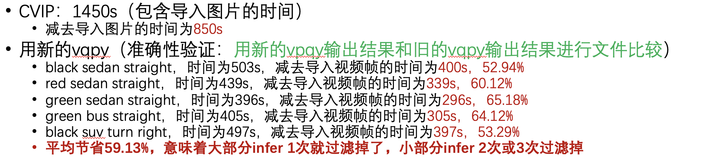

#  AiCity Query

To run the example as a script `main.py`, please first install the python dependencies listed in requirements.txt and download the following data and models:

- Create the following directories:
  - vqpy/examples/aicity_query/data/checkpoints/CLIP_recogition_color/
  - vqpy/examples/aicity_query/data/checkpoints/CLIP_recogition_direction/
  - vqpy/examples/aicity_query/data/checkpoints/CLIP_recogition_type/
  - vqpy/examples/aicity_query/data/checkpoints/CLIP_recogition_v2_standard_extend/
  
  and then download the [models](https://drive.google.com/drive/folders/1CivhsX0xGxRda9EkZ6uqM_CMaJV40KMO), which should be placed in the above directories, respectively.
- Create the following directory:
  - vqpy/examples/aicity_query/input_videos/
  
  and then download the video data, which should be placed in the above directory.
- Create the following directory:
  - vqpy/examples/aicity_query/data/train/
  
  and then download the image data, which should be placed in the above directory.


- When running the example as the script, the command should look like:

    ```shell
    python main.py --save_folder /path/to/output/folder
    ```


Performance Demonstration:
